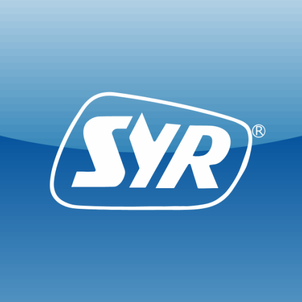

# ioBroker.syrconnectapp

**Tests:** 
**This adapter uses Sentry libraries to automatically report exceptions and code errors to the developers.** For more details and for information how to disable the error reporting see [Sentry-Plugin Documentation](https://github.com/ioBroker/plugin-sentry#plugin-sentry)! Sentry reporting is used starting with js-controller 3.0.

## syrconnectapp adapter for ioBroker

Adapter for SYR Connect App. The adapter can fetch all information/statistics and can control all configuration of the syr connect device.

Current Values:
syrconnectapp.0.project.deviceid.status

**Login:**

Enter SYR Connect App Login information

**Control**

syconnect.0.project.deviceid.remote

set to true for the commands

and

syrconnect.0.project.deviceId.status.dvs.d.c.

#### Examples:

syrconnectapp.0.XXXXX.XXXXX.status.dvs.d.c.getAB

set to 2 to close the valve

syrconnectapp.0.XXXXX.XXXXX.status.dvs.d.c.getPRF

to set the profile to absence or present

## Changelog

<!--
    Placeholder for the next version (at the beginning of the line):
    ### **WORK IN PROGRESS**
-->

### 1.0.2 (2025-02-06)

- (TA2k) initial release

## License

MIT License

Copyright (c) 2025 TA2k <tombox2020@gmail.com>

Permission is hereby granted, free of charge, to any person obtaining a copy
of this software and associated documentation files (the "Software"), to deal
in the Software without restriction, including without limitation the rights
to use, copy, modify, merge, publish, distribute, sublicense, and/or sell
copies of the Software, and to permit persons to whom the Software is
furnished to do so, subject to the following conditions:

The above copyright notice and this permission notice shall be included in all
copies or substantial portions of the Software.

THE SOFTWARE IS PROVIDED "AS IS", WITHOUT WARRANTY OF ANY KIND, EXPRESS OR
IMPLIED, INCLUDING BUT NOT LIMITED TO THE WARRANTIES OF MERCHANTABILITY,
FITNESS FOR A PARTICULAR PURPOSE AND NONINFRINGEMENT. IN NO EVENT SHALL THE
AUTHORS OR COPYRIGHT HOLDERS BE LIABLE FOR ANY CLAIM, DAMAGES OR OTHER
LIABILITY, WHETHER IN AN ACTION OF CONTRACT, TORT OR OTHERWISE, ARISING FROM,
OUT OF OR IN CONNECTION WITH THE SOFTWARE OR THE USE OR OTHER DEALINGS IN THE
SOFTWARE.
